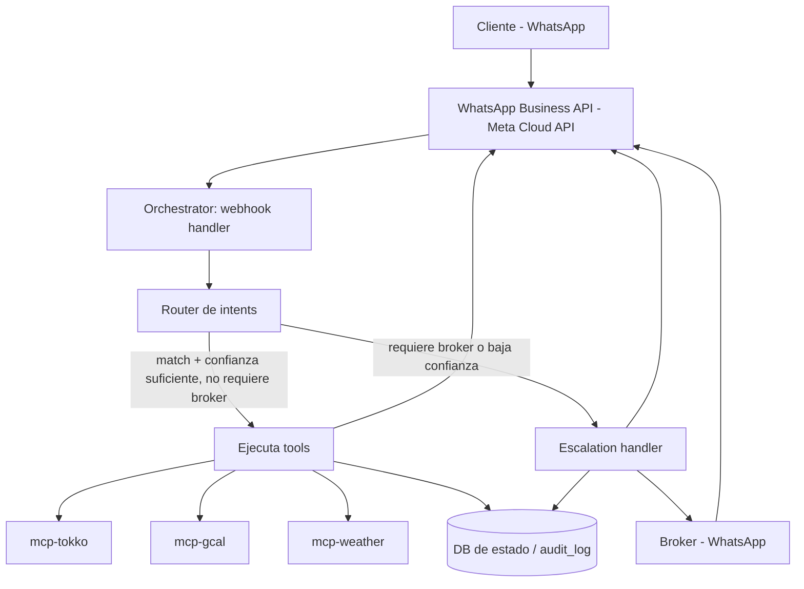

# Arquitectura

Ver `docs/SOW.md` sección 3 y 4 para el detalle completo de decisiones y
alternativas consideradas. Este documento es la referencia rápida del flujo
de mensajes, para no tener que releer el SOW completo cada vez.

## Flujo de mensajes

## Componentes

- **Orchestrator** (`apps/orchestrator`): único punto de entrada de
  mensajes (webhook de WhatsApp). Contiene el router de intents, el loop
  de tool-use con Claude API, la máquina de estados de conversación, y el
  módulo de escalamiento.
- **MCP servers** (`mcp-servers/*`): un wrapper por integración externa.
  El orchestrator los consume como tools vía protocolo MCP. Cada uno debe
  poder testearse de forma aislada.
- **DB de estado**: conversaciones, mensajes, `audit_log`, cache liviano de
  leads/propiedades de Tokko (para no pegarle a su API en cada mensaje),
  reglas de recontacto pendientes.
- **Scheduler** (`apps/orchestrator/src/jobs`): dispara los intents de tipo
  `scheduled` del catálogo (recordatorios, recontacto, seguimiento
  post-visita).

## Por qué MCP y no llamadas HTTP sueltas

Encapsular cada integración como un MCP server separado permite:
- Testear Tokko/Calendar/Weather de forma aislada sin levantar el
  orchestrator completo.
- Versionar cada integración por separado.
- Reusar los mismos servers desde otras superficies en el futuro (por
  ejemplo, el broker consultando Tokko directamente desde Claude Code o
  Claude Desktop, sin pasar por WhatsApp).

## Decisiones pendientes de validar con datos reales

- Si el volumen de mensajes lo justifica, separar el router de intents en
  dos etapas: un clasificador liviano (embeddings) para los intents de
  alto volumen, y el LLM completo con tool-use solo para los casos
  ambiguos. No implementar esto en el POC — el LLM completo como router es
  suficiente para validar el concepto.
